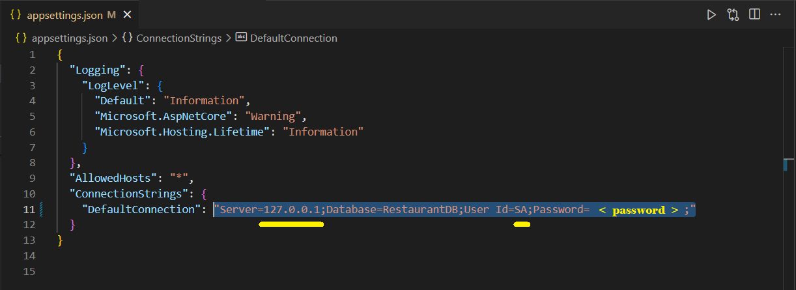
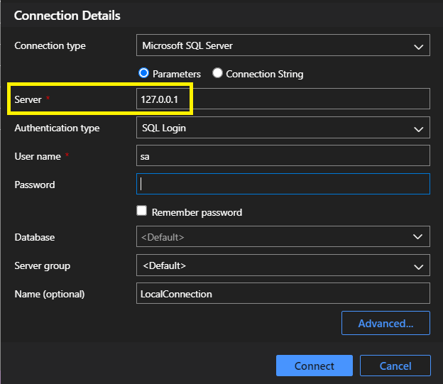
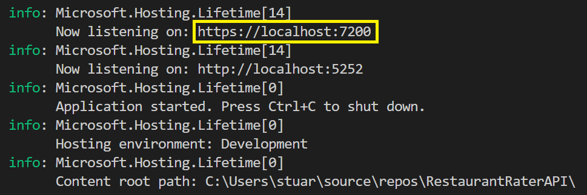
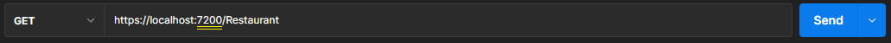
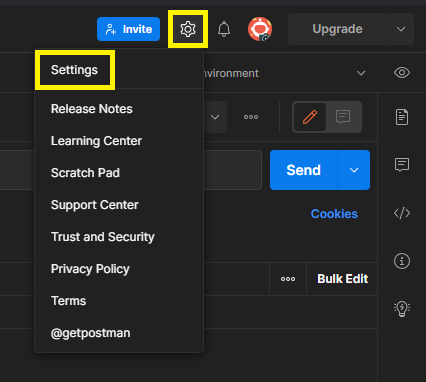
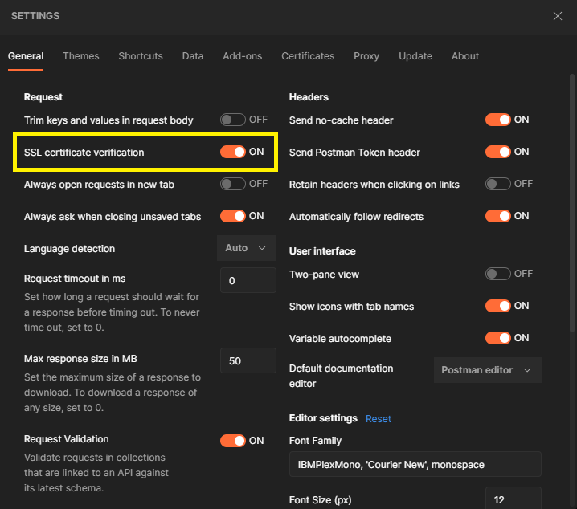

# Restaurant Rater API Walkthrough:
### Common Issues to look out for....

---
---

1. RR API 2.01 - if 'dotnet tool install dotnet-ef' command does not work - use 'dotnet tool install dotnet -ef --global'

---
---

2. RR API 2.04 - changes from .NET5 to .NET6 - view Program.cs file in this repository. Make sure your Program.cs file is the same. There is no Startup.cs in .NET6

---
---

3. The Server name in the connection string in appsettings.json needs to match the server name in your Azure Data Studio connection. If you used '127.0.0.1' for your Server name instead of 'localhost' - your connection string will need to do the same. *NOTE: You will still use 'https://localhost' for http request urls*.

`In appsettings.json:`

`Azure Data Studio - click 'LocalConnection' in ADS Server Explorer to view:`

---
---

4. When you run the app you should see info in the terminal telling you what server the app is listening on. You need to add the port (in my case 7200) to 'localhost' in the http request urls.

`In your VSCode terminal following 'dotnet run' command:`

`Sample POSTMAN http request URL:`

## The URL request in canvas is using 'Restaurants' (PLURAL) - yours might need to just be 'Restaurant' (SINGULAR).

---
---

5. Check to see if SSL certificate verification is ON in Postman settings.

